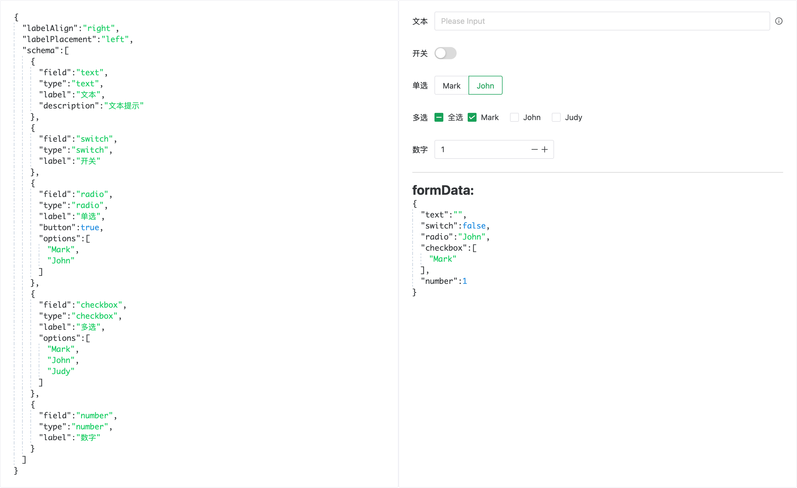
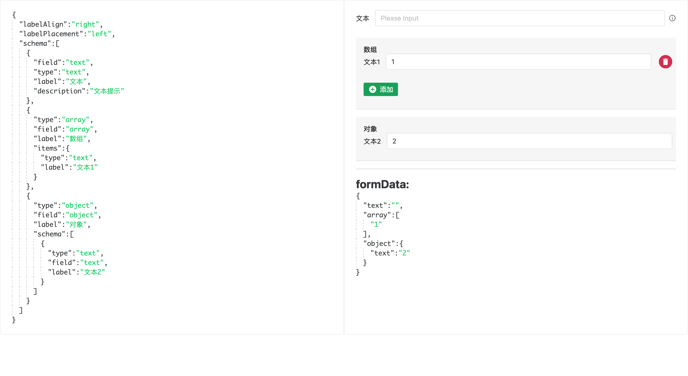
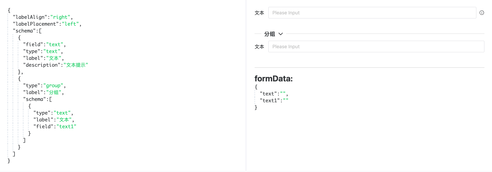

# Formative

一个通过配置生成表单的方案。基于 `vue3` + `naive-ui`。

**本仓库代码仅作为 参考。** 并未进行过大量的测试，如果你有配置化生成表单的 功能需求，或者想了解如何实现 配置化生成表单，可以通过 本仓库 了解实现技术方案。

## 效果展示



字段为 数组/对象：


对字段分组展示：




## 使用

``` tsx
import { defineComponent, ref } from 'vue'
import Formative from 'formative'
import 'formative/style.css'

export default defineComponent({
  name: 'App',
  setup: () => {
    const formConfig = {
      labelAlign: 'right',
      labelPlacement: 'left',
      schema: [
        {
          field: 'text',
          type: 'text',
          label: '文本',
        },
        {
          field: 'switch',
          type: 'switch',
          label: '开关',
        },
        {
          field: 'radio',
          type: 'radio',
          label: '单选',
          button: true,
          options: ['Mark', 'John'],
        },
      ],
    }

    const formData = ref({
      text: '',
      switch: false,
      radio: 'John'
    })

    return () => <Formative config={formConfig} v-model={formData.value}></Formative>
  }
})
```

## 支持表单字段类型

- 文本输入
  - 单行文本
  - 多行文本
- 单选
- 多选
- 下拉选择
- 开关
- 数字

支持 字段 **对象/数组**
支持 对 字段进行 **分组**

## 配置

``` ts
interface FormativeConfig {
  // 是否为行内表单
  inline?: boolean
  // 标签的宽度
  labelWidth?: number | string | 'auto'
  // 标签对齐方式
  labelAlign?: 'left' | 'right'
  // 标签位置
  labelPlacement?: 'top' | 'left'
  // 是否显示标签
  showLabel?: boolean
  // 是否展示必填星号
  showRequireMark?: boolean
  // 是否展示校验反馈
  showFeedback?: boolean
  size?: 'small' | 'medium' | 'large'
  // 默认验证信息
  validateMessage?: string
  // 表单字段配置
  schema: FormativeSchema
}

type FormativeSchema = (FieldItem | GroupField)[]

type FieldItem =
  | TextField // 文本输入字段
  | TextViewField // 文本展示字段
  | RadioField // 单选字段
  | CheckboxField // 多选字段
  | SwitchField // 开关字段
  | SelectField // 选择器字段
  | NumberField // 数字字段
  | ObjectField // 对象字段
  | ArrayField // 数组字段
```

``` ts
interface BasicField {
  // 字段类型
  type: FieldType
  // 字段
  field: string
  // 标签
  label: string
  // 描述信息
  description?: string
  // 校验规则
  rule?: FormItemRule | FormItemRule[]
  // 控制是否显示当前 field
  showField?: boolean | ((fields: Record<string, any>) => boolean)
}
```

更多配置信息，查看 [types.ts](./src/types.ts)

## 启动项目

通过 `git clone` 拉取本项目到本地后，安装依赖，然后启动项目，建议使用 `yarn|pnpm`
```sh
# yarn
yarn dev
# pnpm
pnpm dev
```


----

本项目供学习交流，你可以 clone 本仓库代码，做学习使用、个人项目使用、商业项目使用。
